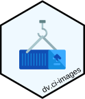

# Docker Images for CI

 

Docker images that will be used for CI purposes via GitHub Actions.

## How it works

The [Dockerfile](./Dockerfile) acts as a template and accepts input arguments like the R version, CRAN snapshot date, linux distribution name and (LTS) version.

The [scripts](./scripts/) folder contains scripts that add R packages and system dependencies to make the final image fit for purpose.

Github Actions [.github/workflows](.github/workflows) support the image building workflows.

## Usage

All available images originating from this repository are available [here](https://github.com/users/Boehringer-Ingelheim/packages/container/package/r_4.3.2_cran_2024.01.12)

## Credits

This repo makes partial use of scripts and concepts defined and maintained by [rocker-org/rocker-versioned2](https://github.com/rocker-org/rocker-versioned2/)
